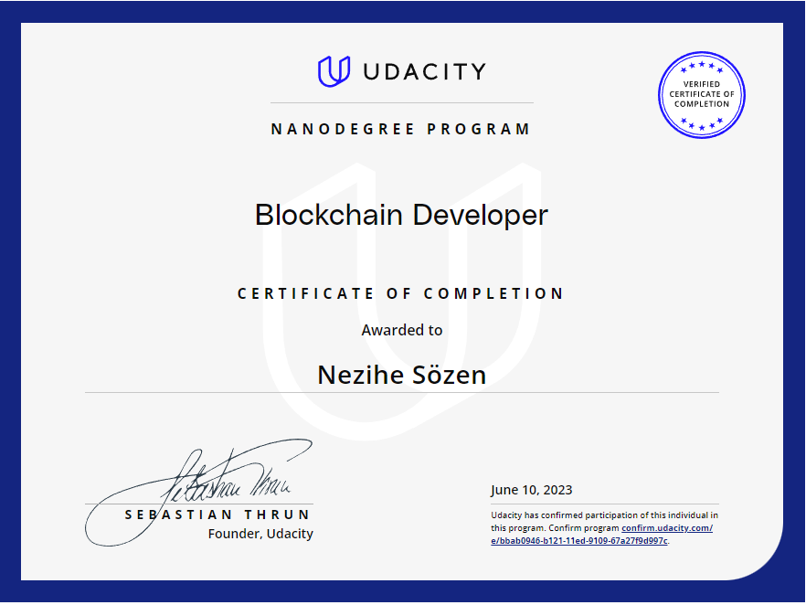

# Udacity-Blockchain-Developer-Nanodegree-Program
Udacity Blockchain Developer Nanodegree Program Projects

### [Project 1 - Create Your Own Private Blockchain](https://github.com/NeziheSozen/Udacity-Blockchain-Developer-Create-Your-Own-Private-Blockchain)

The project covers topics such as creating a genesis block, adding new blocks to the chain, implementing proof of work consensus algorithm, and handling errors and validations. 

We also gain experience using APIs to interact with their blockchain and testing their code using Postman. By the end of the project, we have a functioning private blockchain that can securely store and transfer data, and the knowledge to expand upon their blockchain development skills.

### [Project 2 - Build CryptoStar Dapp on Ethereum](https://github.com/NeziheSozen/Udacity-Blockchain-Developer-Build-CryptoStar-DApp-on-Ethereum)

The Build CryptoStar Dapp on Ethereum project offered by Udacity guides we through the development of a decentralized application (Dapp) using the Ethereum blockchain platform. The project covers topics such as smart contract development using Solidity, deploying the contract on the Goerli test network, and building a user interface using web3.js and HTML/CSS. 

We learn how to use the OpenZeppelin library for secure contract development and implement functionality for users to claim and trade their own unique stars using the ERC-721 token standard. By the end of the project, we have a working Dapp that demonstrates their understanding of Ethereum development and the potential for blockchain technology in creating decentralized applications.

### [Project 3 - Blockchain Architecture](https://github.com/NeziheSozen/Udacity-Blockchain-Developer-Blockchain-Architecture)

3rd project focuses on designing and implementing a blockchain architecture for a supply chain system. We learn about the different components of a blockchain, including nodes, transactions, and blocks, as well as consensus algorithms and smart contracts. They then use this knowledge to design a blockchain architecture that ensures data privacy, security, and immutability. The project involves building a decentralized application (dApp) using the Ethereum blockchain and Solidity programming language, creating a user interface to interact with the dApp, and testing the system to ensure that it meets the project's requirements. The goal of the project is to give us hands-on experience with designing and implementing a blockchain architecture for a real-world use case.

### [Project 4 - DApp with Autonomous Smart Contracts and Oracles]([https://github.com/NeziheSozen/](https://github.com/NeziheSozen/Udacity-Blockchain-Developer-Blockchain-Architecture))

The fourth project focuses on creating a decentralized application (DApp) that uses autonomous smart contracts and oracles. We learn about the role of oracles in connecting blockchain applications to off-chain data sources and events, as well as how to create autonomous smart contracts that operate independently without human intervention. The project involves building a DApp that tracks the temperature and humidity of a shipment in a supply chain system, triggering actions based on predefined rules. Solidity programming language is used to write the smart contracts is used to connect the DApp to an oracle. The project aims to provide hands-on experience with building a DApp that utilizes the latest advancements in blockchain technology.

